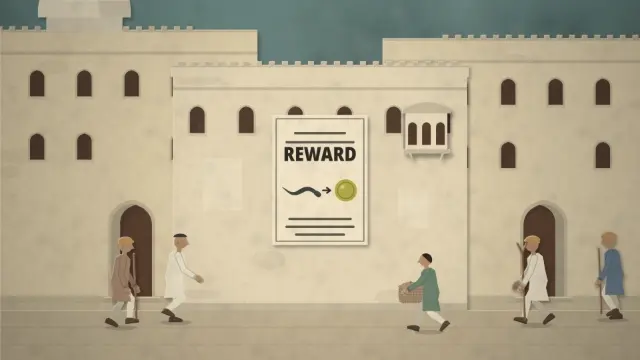
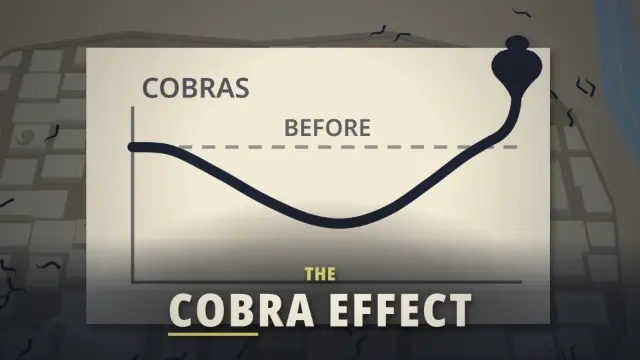
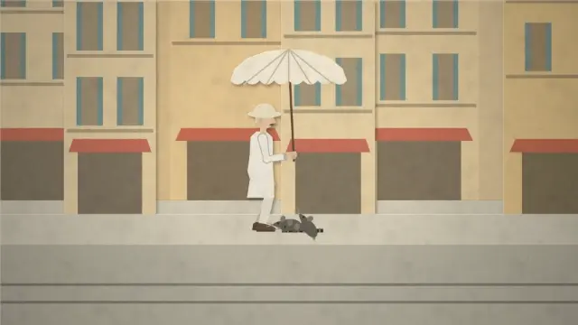
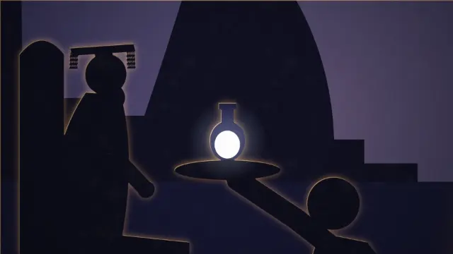

# Nomolos 02 · The Cobra Effect: the animation

  
  
  
  

<h3 align="center"><a href="https://raisulsohan.github.io/Nomolos_02_Cobra_Effect_animation/">▶ Watch the whole film (8:49) in your browser</a></h3>

Click a clip to open its scene.

  <strong>An animated documentary film conceived, illustrated, animated in Adobe After Effects, and sound-composed by <a href="https://raisulsohan.com">Raisul Sohan</a></strong>

---

## Production & Craft

*The Cobra Effect: How a Bounty on Snakes Bred More Snakes* is the second animated documentary in the **Nomolos** series, conceived, written, illustrated, animated, and sound-designed entirely by **[Raisul Sohan](https://raisulsohan.com)**. Spanning 23 complete scenes and 8 minutes 49 seconds, the film unrolls the fascinating historical and behavioral psychology of perverse incentives.

### 1. Adobe After Effects Animation & Compositing
The entire film was animated and composited inside **Adobe After Effects**. Across all 23 scenes, complex multiplane spatial scenes were choreographed using virtual 3D camera rigs, graph editor velocity easing, and bespoke character pacing. No pre-made third-party animation templates were used—every transition and sequence is handcrafted.

### 2. Handcrafted Vector Illustrations
Every single visual asset was illustrated from scratch: the bustling bazaar streets of colonial Delhi, British administrative registry offices, shadowy snake breeding pens, Hanoi sewer hunts, and the imperial court of ancient China. Each composition was designed in modular, layered vector parts to allow multi-dimensional animation rigging.

### 3. Special 3D Parallax Vibe & Spatial Depth
By separating scenes into dozens of depth planes in After Effects 3D space, the film delivers a captivating **parallax effect**. As the virtual camera dollies, cranes, and pans, foreground silhouettes drift past at realistic optical speeds while midground focal subjects and expansive backgrounds shift with genuine depth of field and perspective shifts.

### 4. Atmospheric Signature Glow & Volumetric Lighting
Dramatic chiaroscuro contrasts and signature glows (Deep Glow) accentuate pivotal narrative moments—from the glowing eyes and hood of the rearing cobra population graph to sun-dappled Indian streetscapes and moonlit Hanoi alleys. Layered light falloffs, lens blooms, and stylized film grain elevate the documentary feel.

### 5. Curated Sound Design & Original Audio Scoring
Created with zero budget for commercial production libraries, the complete soundscape was curated and constructed from free and public domain audio archives. Raisul Sohan discovered, cleaned, edited, and layered hundreds of sound effects (**SFX**)—reptilian hisses, clattering metal cages, scurrying rats, coin drops, paper stamps—and composed evocative background music (**BGM / Underscores**) synchronized frame-by-frame with each visual cut.

> **Note:** All 23 scenes of the animated documentary (8:49) are complete and final.

---

## Watch

**Online: https://raisulsohan.github.io/Nomolos_02_Cobra_Effect_animation/**. Play the whole film or any completed scene, in 16:9 widescreen or 4:5 mobile.

Offline, open `index.html` or any scene in a browser. No server is needed.

- `preview/` holds the whole film (`Nomolos_02_Cobra_Effect_film_Desktop.html`, `Nomolos_02_Cobra_Effect_film_Mobile.html`, 8:49) and the film scene by scene:
  `Nomolos_02_Cobra_Effect_scene-NN_Desktop.html` (16:9, 1920×1080) and `Nomolos_02_Cobra_Effect_scene-NN_Mobile.html` (4:5, 1080×1350).
- `sequences/seq-NN/` holds the individual sequences each scene is made of: `film.html` (16:9) and `film-4x5.html` (4:5).

Player keys: <kbd>Space</kbd> play/pause, <kbd>←</kbd>/<kbd>→</kbd> one frame, <kbd>Shift</kbd>+<kbd>←</kbd>/<kbd>→</kbd> one second, <kbd>Home</kbd> back to the start, <kbd>F</kbd> fullscreen.

---

## Completed Scenes

| Scene | Name | Time | Status |
|---|---|---|---|
| Scene 01 | The bounty | 0:00.0–0:29.3 | **FINAL** |
| Scene 02 | The snake farm | 0:29.3–0:45.0 | **FINAL** |
| Scene 03 | The cages open | 0:45.0–1:09.5 | **FINAL** |
| Scene 04 | How do you make them? | 1:09.5–1:36.9 | **FINAL** |
| Scene 05 | Pay them | 1:36.9–1:53.7 | **FINAL** |
| Scene 06 | The crack | 1:53.7–2:19.4 | **FINAL** |
| Scene 07 | What you measure | 2:19.4–2:36.1 | **FINAL** |
| Scene 08 | Part legend | 2:36.1–3:07.8 | **FINAL** |
| Scene 09 | Hanoi, 1902 | 3:07.8–3:36.4 | **FINAL** |
| Scene 10 | Just the tail | 3:36.4–4:00.0 | **FINAL** |
| Scene 11 | Rats with no tails | 4:00.0–4:11.3 | **FINAL** |
| Scene 12 | The real math | 4:11.3–4:47.6 | **FINAL** |
| Scene 13 | A name for it | 4:47.6–5:08.2 | **FINAL** |
| Scene 14 | Broken bones | 5:08.2–5:31.8 | **FINAL** |
| Scene 15 | Fake accounts, closed bugs | 5:31.8–5:47.7 | **FINAL** |
| Scene 16 | Buying a number | 5:47.7–6:07.3 | **FINAL** |
| Scene 17 | The proxy | 6:07.3–6:35.6 | **FINAL** |
| Scene 18 | The reversal | 6:35.6–6:55.5 | **FINAL** |
| Scene 19 | Nobody was stupid | 6:55.5–7:19.6 | **FINAL** |
| Scene 20 | Everywhere | 7:19.6–7:47.8 | **FINAL** |
| Scene 21 | The lesson | 7:47.8–7:59.6 | **FINAL** |
| Scene 22 | One person | 7:59.6–8:23.4 | **FINAL** |
| Scene 23 | The emperor, next | 8:23.4–8:49.5 | **FINAL** |

---

## Author & Credits

- **Creator, Director, Screenwriter & Lead Animator:** [Raisul Sohan](https://raisulsohan.com) ([@raisulsohan](https://github.com/raisulsohan))
- **Art Direction & Vector Illustration:** Hand-illustrated by Raisul Sohan
- **Motion Animation & Compositing:** Crafted in Adobe After Effects by Raisul Sohan
- **Sound Design, SFX, BGM & Audio Scoring:** Curated, edited, and composed by Raisul Sohan from free audio archives
- **Production:** Nomolos Documentaries (Episode 02 · The Cobra Effect)

## License

The fonts are Noto Sans and Poppins, © The Noto Project Authors and Indian Type Foundry, under the SIL Open Font License 1.1 (`fonts/OFL.txt`).
